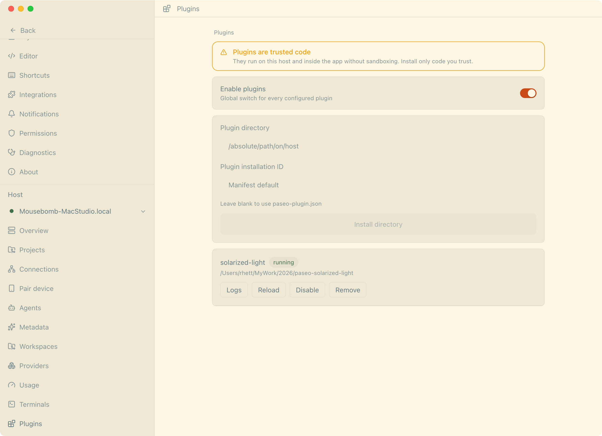
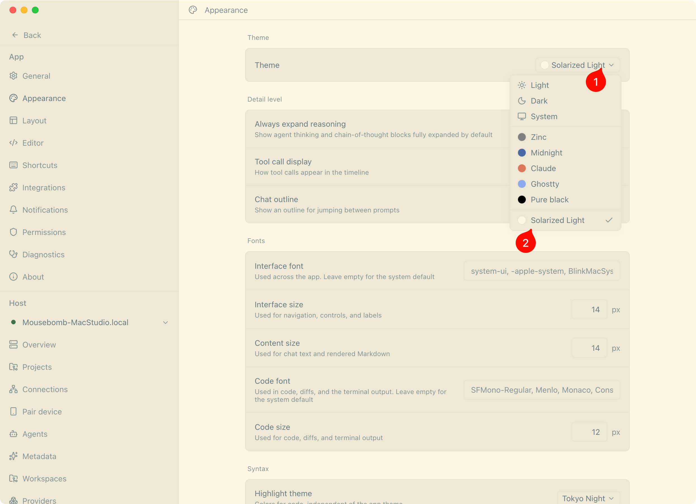

# Paseo Solarized Theme Plugin

[中文](README.md) | English

A **Solarized** light/dark dual theme for [Paseo](https://github.com/getpaseo/paseo). Low-contrast and easy on the eyes, ideal for long coding sessions. One plugin ships both **Solarized Light** and **Solarized Dark** — switch between them under **Settings → Appearance → Theme**.

Implemented through Paseo's official plugin theme contribution point (`client.addTheme`; theme support was introduced in v0.5.0, and v0.8.0 moved plugins to split client/server entries). **No modification of Paseo's own files required** — safe across upgrades.

https://github.com/user-attachments/assets/d5a20398-b03c-4917-ac1c-a6994813662b

## Palette

Based on [Solarized](https://ethanschoonover.com/solarized) by Ethan Schoonover (MIT License, see `NOTICE`). The two themes take the light and dark ends of the palette respectively:

| Plugin field | Solarized Light | Solarized Dark |
|---|---|---|
| `background` | `#fdf6e3` base3 | `#002b36` base03 |
| `foreground` | `#657b83` base00 | `#839496` base0 |
| `raised` / `control` | `#eee8d5` base2 | `#073642` base02 |
| `border` (user bubble background) | `#e6e0cd` | `#073642` base02 |
| `accent` | `#cb4b16` orange | `#2aa198` cyan |
| `mutedForeground` | `#839496` base0 | `#586e75` base01 |
| `ring` | `#586e75` base01 | `#93a1a1` base1 |

Two deliberate deviations: the dark theme uses base0 for body text (base00 only reaches 3.4:1 on `#002b36`), and its `accent` is cyan (orange as an accent background yields only 3.3:1 against dark text). The user message bubble background is bound to the `border` field; on dark it is base02, giving bubble text 4.1:1.

## Requirements

- Paseo **0.8.0** or later (`paseo-plugin.json` declares `requirements.paseo >=0.8.0`, so the plugin no longer runs on pre-0.8 hosts)
- Node.js 22+ (only needed for the source-directory install)

## Install

### Option 1: Install from Git repository (recommended, Paseo 0.8.0+)

```bash
paseo plugin add mousebomb/paseo-solarized
paseo plugin update solarized   # update to the latest
paseo plugin status solarized   # check version status
```

If `paseo` is not on your PATH, use the full path:

```bash
/Applications/Paseo.app/Contents/Resources/bin/paseo plugin install mousebomb/paseo-solarized
/Applications/Paseo.app/Contents/Resources/bin/paseo reload
```

### Option 2: Source-directory install (for development, Paseo 0.8.0+)

```bash
git clone https://github.com/mousebomb/paseo-solarized.git
cd paseo-solarized
npm install
npm run typecheck

# install into the Paseo daemon
paseo plugin install /path/to/paseo-solarized
paseo reload
```

If `paseo` is not on your PATH, use the full path:

```bash
/Applications/Paseo.app/Contents/Resources/bin/paseo plugin install /path/to/paseo-solarized
/Applications/Paseo.app/Contents/Resources/bin/paseo reload
```

### Enable

1. Open Paseo → **Settings → Plugins** → turn on **Enable plugins** (global switch)
2. **Settings → Appearance** → select **Solarized Light** or **Solarized Dark** as the Theme





## Usage

- Hot-reload after code changes: `paseo plugin reload solarized`
- Check status: `paseo plugin ls`
- View logs: `paseo plugin logs solarized`
- Disable/Enable: `paseo plugin disable solarized` / `paseo plugin enable solarized`
- Remove (removes config only, keeps the source directory): `paseo plugin remove solarized`

## License

- Plugin code: MIT
- Solarized palette: MIT, Copyright (c) 2011 Ethan Schoonover — full license in [`NOTICE`](./NOTICE)
