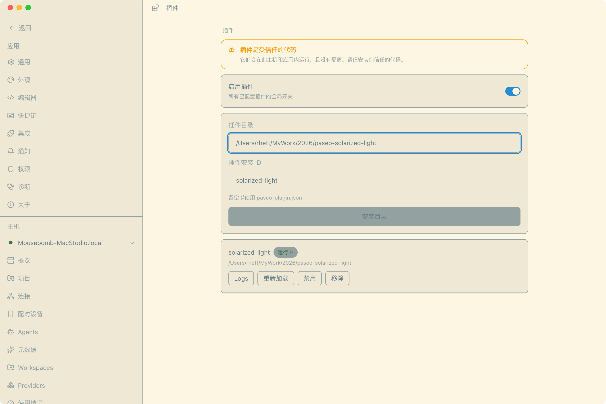
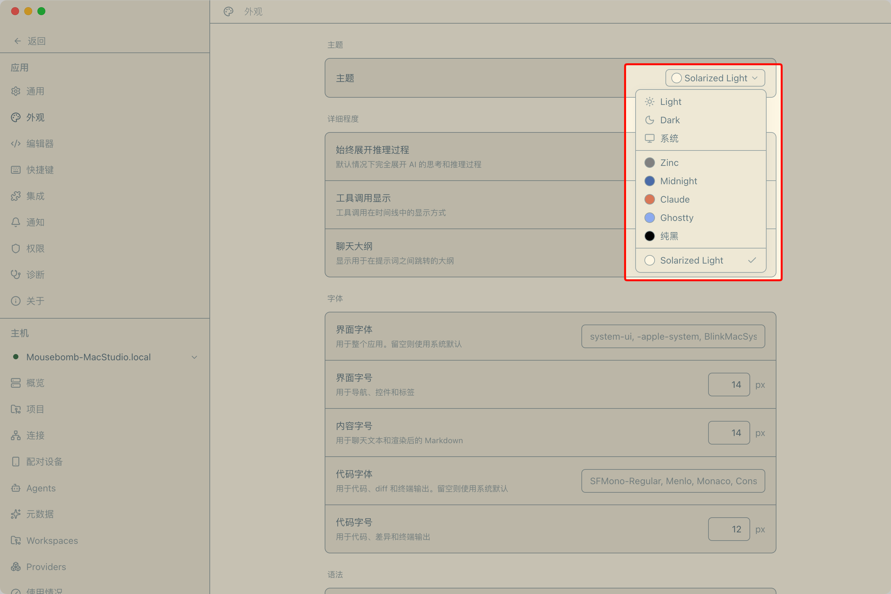

# Paseo Solarized Light 主题插件

为 [Paseo](https://github.com/getpaseo/paseo) 贡献的 **Solarized Light** 应用主题，低对比度、柔和护眼，适合长期盯着屏幕的编程场景。

本插件通过 Paseo 官方的插件主题贡献点（`plugin.addTheme`，随 v0.5.0 引入）实现，**无需修改 Paseo 任何文件**，升级不丢失。

## 色板

基于 Ethan Schoonover 的 [Solarized](https://ethanschoonover.com/solarized) 配色（MIT License，见 `NOTICE`）：


## 环境要求

- Paseo **0.5.1** 或更高版本（`addTheme` 于 0.5.0 引入，更低版本会报 `plugin.addTheme is not a function`）
- Node.js 22+

## 安装

### 本机安装（源码目录）

```bash
cd /Users/rhett/MyWork/2026/paseo-solarized-light
npm install
npm run typecheck

# 安装到 Paseo daemon
paseo plugin install /Users/rhett/MyWork/2026/paseo-solarized-light
paseo reload
```

如果 `paseo` 命令不在 PATH，用完整路径：

```bash
/Applications/Paseo.app/Contents/Resources/bin/paseo plugin install /Users/rhett/MyWork/2026/paseo-solarized-light
/Applications/Paseo.app/Contents/Resources/bin/paseo reload
```

### 启用

1. 打开 Paseo → **Settings → Plugins** → 打开 **Enable plugins**（全局开关）
2. **Settings → Appearance** → Theme 选择 **Solarized Light**





## 使用

- 改代码后热重载：`paseo plugin reload solarized-light`
- 查看状态：`paseo plugin ls`
- 查看日志：`paseo plugin logs solarized-light`
- 停用/启用：`paseo plugin disable solarized-light` / `paseo plugin enable solarized-light`
- 移除（只删配置，不删源码目录）：`paseo plugin remove solarized-light`


## License

- 插件代码：MIT
- Solarized 配色：MIT，Copyright (c) 2011 Ethan Schoonover，完整许可见 [`NOTICE`](./NOTICE)