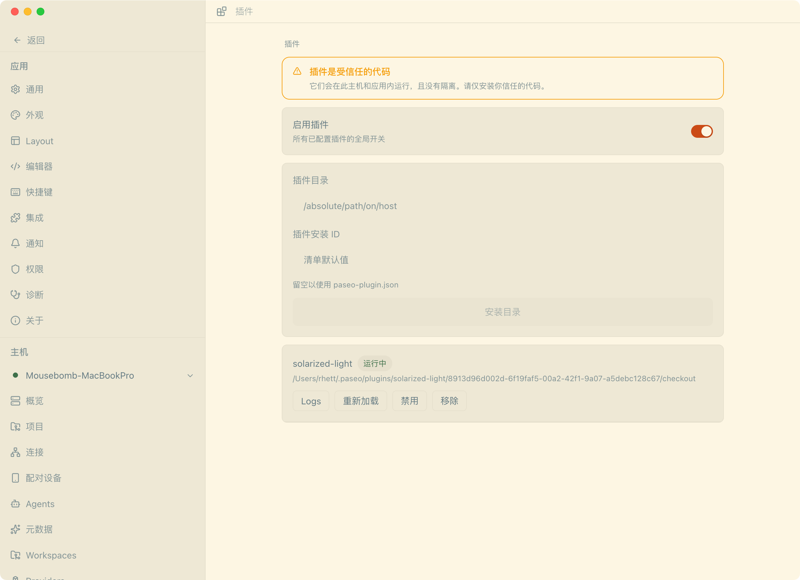
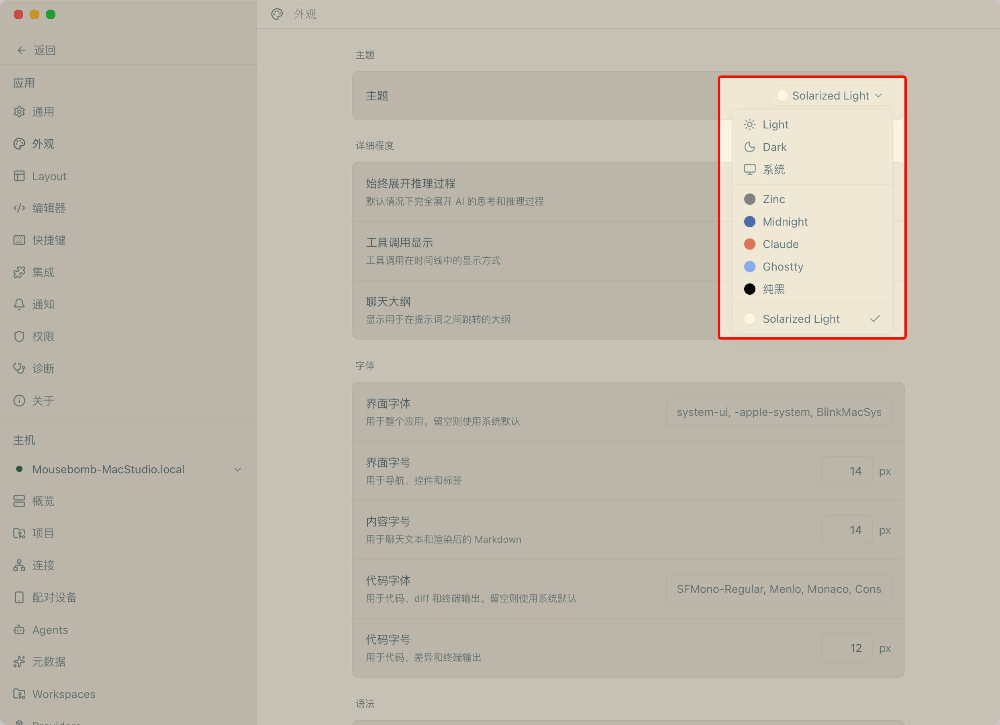

# Paseo Solarized Light 主题插件

[English](README.en.md) | 中文

为 [Paseo](https://github.com/getpaseo/paseo) 移植的 **Solarized Light** 应用主题，低对比度、柔和护眼，适合长期盯着屏幕的编程场景。

本插件通过 Paseo 官方的插件主题贡献点（`client.addTheme`；主题能力自 v0.5.0 引入，v0.8.0 起插件改用 client/server 分离入口）实现，**无需修改 Paseo 任何文件**，升级不丢失。

## 色板

基于 Ethan Schoonover 的 [Solarized](https://ethanschoonover.com/solarized) 配色（MIT License，见 `NOTICE`）：


## 环境要求

- Paseo **0.8.0** 或更高版本（`paseo-plugin.json` 声明 `requirements.paseo >=0.8.0`，插件不再兼容 0.8 以下 host）
- Node.js 22+（仅源码目录安装需要）

## 安装

### 方式1️⃣：从 Git 仓库安装（推荐，Paseo 0.8.0+）

```bash
paseo plugin add mousebomb/paseo-solarized-light
paseo plugin update solarized-light   # 更新到最新
paseo plugin status solarized-light   # 查看版本状态
```

### 方式2️⃣:源码目录安装（开发迭代用，Paseo 0.8.0+）

```bash
git clone https://github.com/mousebomb/paseo-solarized-light.git
cd paseo-solarized-light
npm install
npm run typecheck

# 安装到 Paseo daemon
paseo plugin install /path/to/paseo-solarized-light
paseo reload
```

如果 `paseo` 命令不在 PATH，用完整路径：

```bash
/Applications/Paseo.app/Contents/Resources/bin/paseo plugin install mousebomb/paseo-solarized-light
/Applications/Paseo.app/Contents/Resources/bin/paseo reload
```

### 启用

1. 打开 Paseo → **Settings → Plugins** → 打开 **Enable plugins**（全局开关）
2. **Settings → Appearance** → Theme 选择 **Solarized Light**





## 使用

- 改代码后热重载：`paseo plugin reload solarized-light`
- 查看状态：`paseo plugin ls`
- 查看日志：`paseo plugin logs solarized-light`
- 停用/启用：`paseo plugin disable solarized-light` / `paseo plugin enable solarized-light`
- 移除（只删配置，不删源码目录）：`paseo plugin remove solarized-light`


## License

- 插件代码：MIT
- Solarized 配色：MIT，Copyright (c) 2011 Ethan Schoonover，完整许可见 [`NOTICE`](./NOTICE)